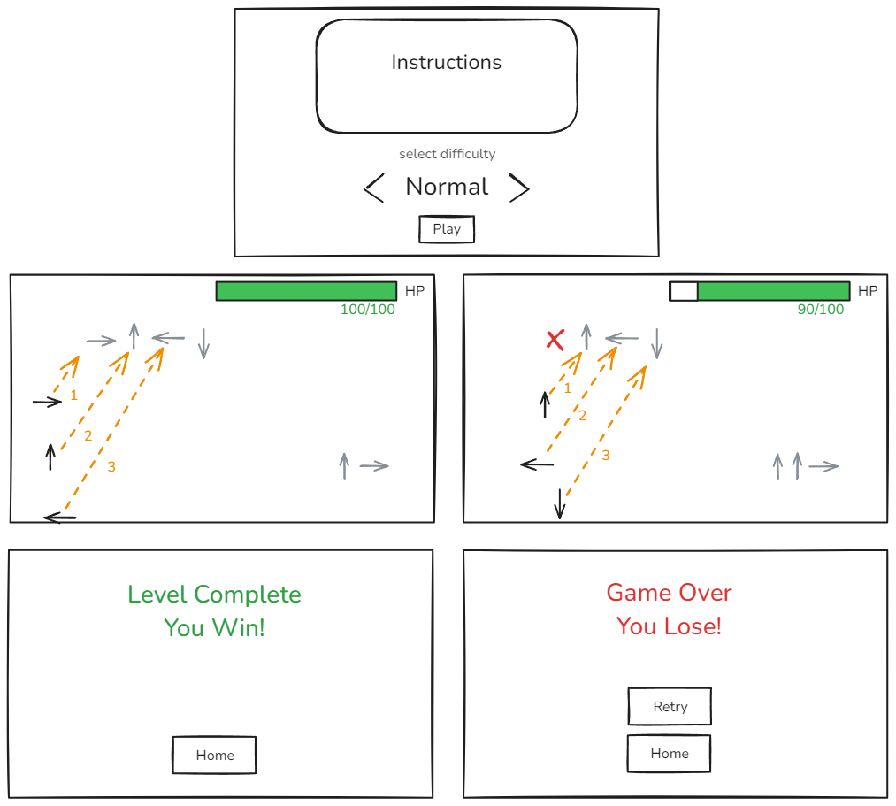
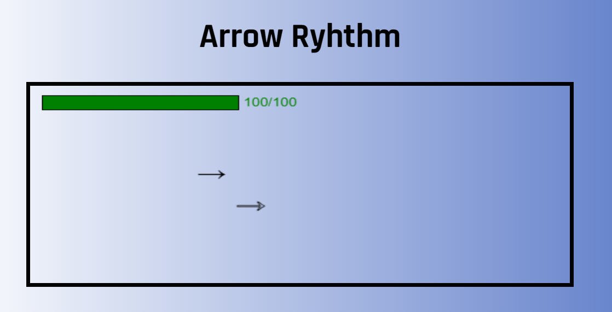
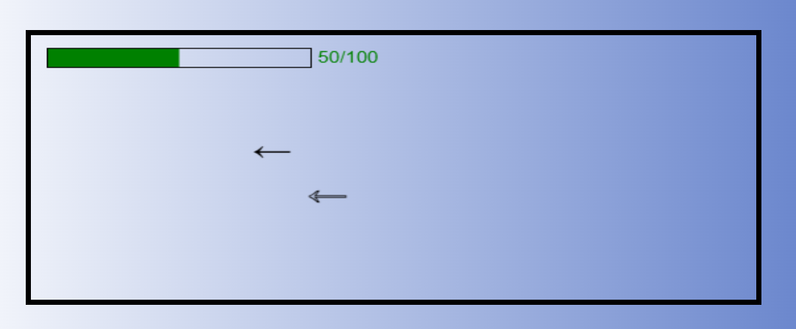
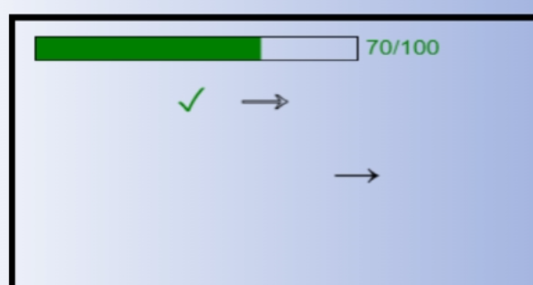
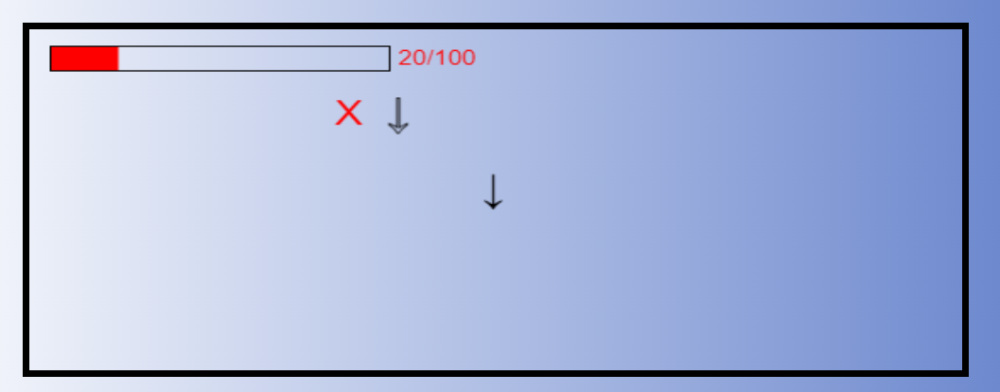
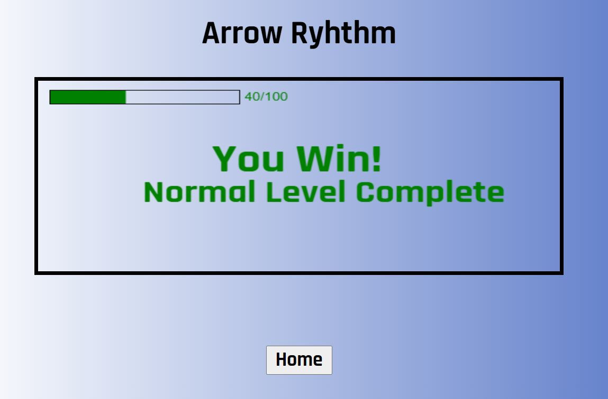
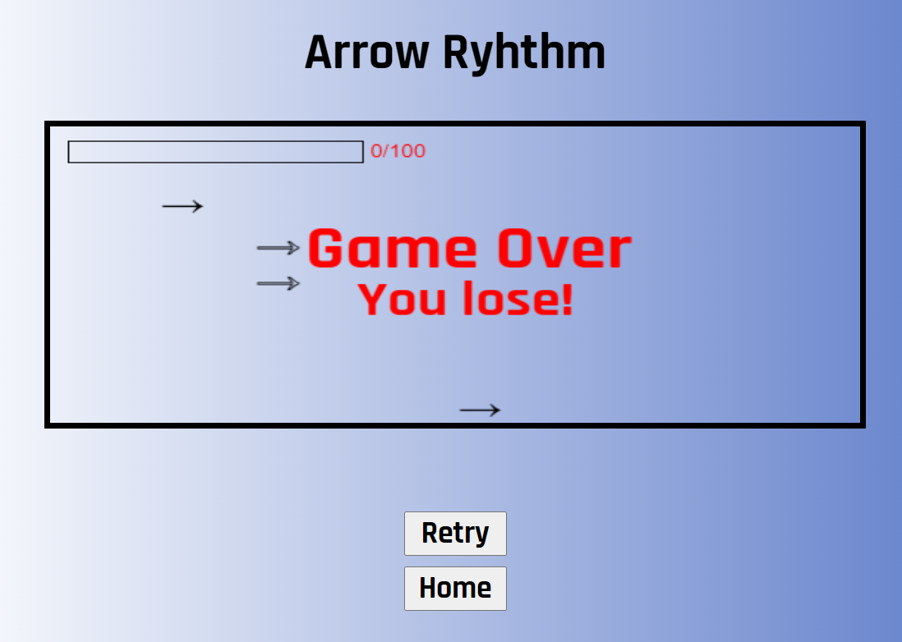

## Arrow Rhythm
### Game Idea and 
A rhythm game where the player needs to use the arrow keys and press the corresponding arrows that appear on the screen in the correct order and timing.

### User stories
As a user in this game, I want

- to be able to read the instructions on how to play the game before starting the game in the starting/landing page.
- to be able to cycle between "Normal" and "Hard" as the game difficulty.
- to be able to start the game by clicking on the Play button, which should start the game on the currently selected difficulty.
- to be able to tell when should I time my button presses.
- to be able to see the order of the arrows to be pressed of each sequence displayed before the first arrow of that sequence.
- to be able to see the arrows ahead of time so I can know and time my button press more easily.
- to have visual feedback telling me if I have pressed the arrows on the correct time or not.
- to see my HP drop upon missing any button in any sequence, which should result in a loss upon losing all of my HP.
- to see a game over screen or a victory screen upon losing or winning the game.
- to able to click on retry on the game over screen to quickly restart the level or click on home to go back to the starting page.
- to be able to click on home in the victory screen to go back to the starting page.
- the game to end and result in a victory if my HP did not drop to 0

### Pseudo code

// define the constants for the game:
  // game canvas
  // array for displaying currently rendered arrows

// define the variables for the game:
  // variable for game difficulty
  // variable for health points
  // variable to count the number of sequences
  // variable for frameRequestAnimation
  // variable for time interval and timeouts

// select the cache elements

// add event listeners for 
  // play, home and retry buttons
  // key presses for the arrows

// when the user clicks on the Play button, call Init and set the difficulty to the selected one.
  // hide the instructions and buttons elements and display health bar element
  // call gameStart function which will start an interval based on difficulty

// create the html canvas for to be used for drawing the game

// create an arrow class so each arrow has its own logic and methods to help with checking for timings.

// check for timing of key presses. Get key press and check if key was pressing within a set margin in milliseconds

// IF the user presses the wrong arrow or IF the user completely missed the window to press the button, HP should decrement by 10

// render the win or lose message when the game ends 

// call init and gameStart when the user clicks on retry

### Landing Page

