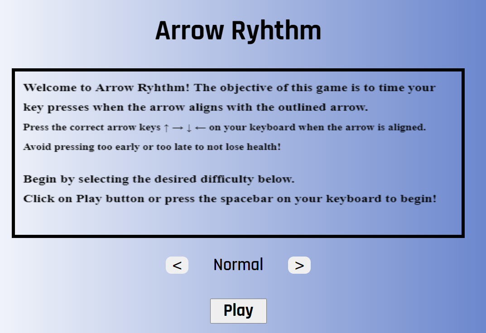

## Arrow Rhythm
### Game Idea
A rhythm game where the player needs to use the arrow keys and press the corresponding arrows that appear on the screen in the correct order and timing.

https://themohsaleh.github.io/arrow-rhythm/

### Technologies
- HTML - Structure and content of the webpage
- HTML Canvas - Element for rendering 2D shapes
- Javascript - Logic of the webpage
- CSS - Style

### User stories
As a user in this game, I want

- to be able to read the instructions on how to play the game before starting the game in the starting/landing page.
- to be able to cycle between "Normal" and "Hard" as the game difficulty.
- to be able to start the game by clicking on the Play button, which should start the game on the currently selected difficulty.
- to be able to tell when should I time my button presses.
- to be able to see the arrows ahead of time so I can know and time my button press more easily.
- to have visual feedback telling me if I have pressed the arrows on the correct time or not.
- to see my HP drop upon missing any button in any sequence, which should result in a "Game Over" screen upon losing all of my HP.
- to see a game over screen or a victory screen upon losing or winning the game.
- to be able to click on retry on the game over screen to quickly restart the level or click on home to go back to the starting page.
- to be able to click on home in the victory screen to go back to the starting page.
- the game to end and result in a victory if my HP did not drop to 0 and there are no more arrows to be pressed.

### Pseudo code

// define the constants for the game:
  // game canvas
  // array for displaying currently rendered arrows

// define the variables for the game:
  // variable for game difficulty
  // variable for health points
  // variable to count the number of sequences
  // variable for frameRequestAnimation
  // variable for time interval and timeouts

// select the cache elements

// add event listeners for 
  // play, home and retry buttons
  // key presses for the arrows

// when the user clicks on the Play button, call Init and set the difficulty to the selected one.
  // hide the instructions and buttons elements and display health bar element
  // call gameStart function which will start an interval based on difficulty

// create the html canvas for to be used for drawing the game

// create an arrow class so each arrow has its own logic and methods to help with checking for timings.

// check for timing of key presses. Get key press and check if key was pressing within a set margin in milliseconds

// IF the user presses the wrong arrow or IF the user completely missed the window to press the button, HP should decrement by 10

// render the win or lose message when the game ends 

// call init and gameStart when the user clicks on retry

### Landing Page
Read the instructions to get an idea of how the game works. Afterwards, cycle through the available difficulties and click on the play button to begin (alternatively, press spacebar on the keyboard to start).

### Playing the game

To play the game, [Click here!](https://themohsaleh.github.io/arrow-rhythm/)

#### Game Rules
The player will have to press on the arrow keys on their keyboard for each arrow on the screen when they align up with their shadow part.
For example, when the filled → aligns with the outlined → , Press the Right Arrow key to hit the arrow on beat!

#### Successful Arrow Hit
When the arrow is hit correclty, a very brief **green checkmark** will appear to indicate a successfully timed arrow press!

#### Early Arrow Hit
When pressing the arrow key too early, a **red X** will appear to indicate that the arrow was pressed to early and will not count as a successful arrow hit.

#### Healthbar
The player's healthbar is displayed on the top left of the game's border. The health points of the player is 100 and resets every time a new game starts.

Each unsuccessful arrow hits (either early hits or missed hits) will deduct 10 HP from the player. This means that the player is only allowed to have at most 9 **unsuccessful** arrow hits throughout the entire level to still be able to win the game. When reaching 10 failed arrow hits the game will end lt in a defeat. 

#### Victory
When all the set arrows are expired for the level, the game will end in victory if the player has more than 0 health remaining at the end of the level.

Additionally, the victory text message changes if the player survived the entire level with full health!

#### Defeat
Upon losing all health, the player will be shown a Game Over screen. During the intial display of this screen, the retry and home buttons will be displayed with a slight delay due to technical issues.

Cicking on Retry or pressing the spacebar will restart the level with the same selected difficulty

### Next Steps - Future Plans

- Add more levels, such as endless mode
- Add mobile compatibility
- Add support for higher refresh monitors